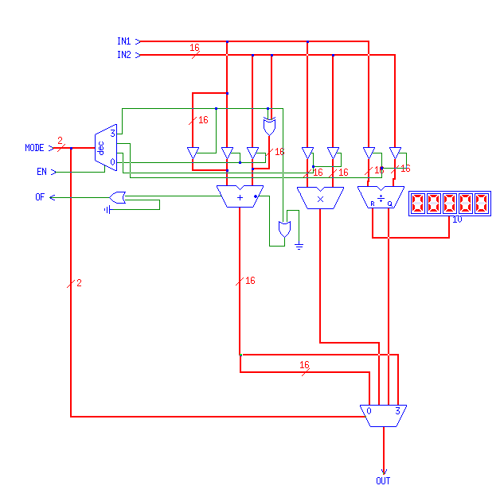

# 🎮 The Sum-Till-N CPU: A "Drag-and-Drop" CPU Adventure! 🎮

Ever wanted to build a CPU without writing a single line of code? Welcome to the **Sum-Till-N CPU**, a fully-functional 16-bit processor designed entirely by dragging and dropping components in the **TkGate** digital circuit simulator!

This project is a fun, hands-on exploration of computer architecture. It's built to solve one problem perfectly: **calculating the sum of the first N natural numbers.** It's a testament to what you can build when you get creative with digital logic.

## 🚀 What's Inside?

This isn't your typical codebase. Instead of hand-written HDL files, you'll find a TkGate project file (`COA Lab Project Sum Till N.v`). This file is a netlist that describes the circuit, but the real magic happens when you open it in TkGate.

*   **Visual Design:** See how the CPU is built, component by component, from the ground up.
*   **Interactive Simulation:** Watch the data flow through the datapath, see the registers update, and witness the program execute in real-time!
*   **Deep-Dive Documentation:** A comprehensive guide to the CPU's architecture, its custom Instruction Set (ISA), and how it all comes together.

## 🖼️ See It in Action!

Here's a sneak peek at the CPU's design from the inside:

### Full Circuit Diagram

### ALU Diagram

### Components Diagram

## ⚙️ How to Explore This Project

1.  **Get TkGate:** You'll need to have the [TkGate simulator](http.www.tkgate.org/) installed on your system.
2.  **Open the Project:** Launch TkGate and open the `COA Lab Project Sum Till N.v` file.
3.  **Run the Simulation:** Start the simulation and watch the CPU come to life!

To truly understand what's going on under the hood, you'll need to read the full documentation, especially the **Instruction Set Architecture (ISA)**. This is the key to understanding the language our little CPU speaks.

➡️ **[Dive into the Full Technical Documentation!](DOCUMENTATION.md)**

## 🤝 Contributing

Since this is a visual design project, contributing is a bit different from a typical software project. If you have ideas for improvements, new features (pipelining, anyone?), or find a bug in the design, please feel free to open an issue on GitHub! We'd love to hear your thoughts and suggestions.